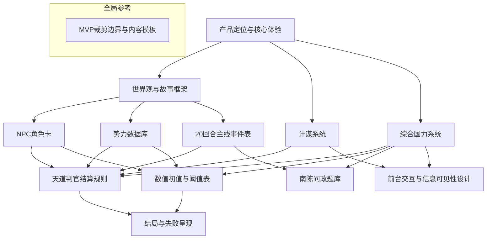

# 《佞臣》策划案总索引

> 本文档是《佞臣》策划案 v1 的阅读导航与文件地图。  
> 所有模块化策划文件均可独立阅读，但建议按下方推荐顺序通读以获得最佳理解。

---

## 1. 文件地图

| 编号 | 文件名 | 内容简介 | 适合谁读 |
|------|--------|---------|---------|
| 01 | [产品定位与核心体验.md](产品定位与核心体验.md) | 项目定义、产品形态、核心爽点、设计原则、胜负条件、回合流程 | 所有人 |
| 02 | [世界观与故事框架.md](世界观与故事框架.md) | 架空南北朝背景、主角设定、女帝与南陈战略、北周线/南陈线双线结构 | 所有人 |
| 03 | [NPC角色卡.md](NPC角色卡.md) | 11位核心NPC标准化角色卡 + Agent设计原则 + 关系网络矩阵 | 策划 / AI工程 |
| 04 | [势力数据库.md](势力数据库.md) | 四大势力（帝党/后党/陇右勋贵/草原势力）的组织描述、战略目标、态度矩阵、三项指标 | 策划 / AI工程 |
| 05 | [计谋系统.md](计谋系统.md) | 8类计谋定义、信任度解锁逻辑、详细使用口径 | 策划 / 前端 / AI工程 |
| 06 | [综合国力系统.md](综合国力系统.md) | 五维主指标体系、二级指标、变动规则、折算公式、短板惩罚、法统处理 | 策划 / 后端 |
| 07 | [南陈问政题库.md](南陈问政题库.md) | 20回合问政题完整题库，含四选项与五维影响映射 | 策划 / AI工程 |
| 08 | [天道判官结算规则.md](天道判官结算规则.md) | 回合结算核心裁判系统：行动-数值映射、结算优先级、Agent I/O接口 | 后端 / AI工程 |
| 09 | [数值初值与阈值表.md](数值初值与阈值表.md) | 南北五维初始值、二级指标初值、自然增长率、NPC信任度初值、各类阈值 | 后端 / 数值策划 |
| 10 | [20回合主线事件表.md](20回合主线事件表.md) | 20回合叙事骨架、结构化事件字段表、核心NPC每回合反馈方向与动机骨架 | 策划 / AI工程 |
| 11 | [前台交互与信息可见性设计.md](前台交互与信息可见性设计.md) | 8个核心页面信息架构、信息可见性规则（标签制/三级信号）、新手引导 | 前端 / UX |
| 12 | [结局与失败呈现.md](结局与失败呈现.md) | 4种主结局触发条件、文案风味、结局页UI结构、远期预留结局 | 策划 / 前端 |
| 13 | [MVP裁剪边界与内容模板.md](MVP裁剪边界与内容模板.md) | MVP必做/可选/远期扩展清单 + 回合事件/角色卡/问政题标准化模板 | 所有人 |

---

## 2. 推荐阅读顺序

### 快速了解（30 分钟）
1. `产品定位与核心体验.md` → 知道这是什么游戏
2. `世界观与故事框架.md` → 知道故事在讲什么
3. `MVP裁剪边界与内容模板.md` → 知道 Demo 做哪些、不做哪些

### 深入理解（2 小时）
4. `NPC角色卡.md` → 了解 11 个核心角色
5. `势力数据库.md` → 了解四大势力格局
6. `计谋系统.md` → 了解玩家操作空间
7. `20回合主线事件表.md` → 了解 20 回合故事线

### 系统实现（按需）
8. `综合国力系统.md` → 五维国力体系
9. `数值初值与阈值表.md` → 所有数值与阈值
10. `天道判官结算规则.md` → 结算流程与接口规范
11. `南陈问政题库.md` → 完整题库
12. `前台交互与信息可见性设计.md` → 页面与信息展示
13. `结局与失败呈现.md` → 结局系统

---

## 3. 关键设计判断清单（已锁定）

以下 10 条核心设计判断已在策划案 v0.3 中锁定，后续开发不应随意变更：

1. **北周线 : 南陈线 = 8 : 2**
2. **计谋采用"框架 + 一句话说辞"** 的混合交互
3. **NPC 大战略由规则决定，Agent 只负责局部表达与反馈**
4. **暗线优先做"固定秘密"** 而非动态欲望
5. **死亡采用单 NPC 触发制**
6. **提前南伐采用政治意愿 + 可战能力双门槛**
7. **问政采用预设题目 + 四选一 + 理由小修正**
8. **综合国力用五维主指标 + 二级指标 + 短板惩罚**
9. **法统不做主维度，改做隐性修正项**
10. **20 回合事件表已完成骨架版、结构版与核心 NPC 动机版**

---

## 4. 文件间依赖关系

---

## 5. 后续推进方向

策划案 v1 完成后，最适合继续推进的工作：

1. **逐回合事件细稿** — 为 20 回合填充播报文案、锦囊文本、收束总结
2. **NPC 回应文本库** — 各计谋下 NPC 的典型回应样板
3. **前端原型** — 基于 `前台交互与信息可见性设计.md` 搭建 H5 页面
4. **天道判官 Agent Prompt** — 基于 `天道判官结算规则.md` 编写完整 System Prompt
5. **Playtest 脚本** — 编写 5 回合快速试玩的最小可玩版本
